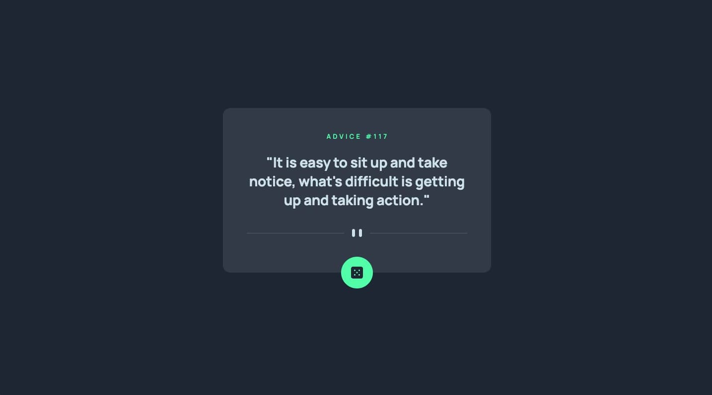

# Frontend Mentor - Advice generator app solution

This is a solution to the [Advice generator app challenge on Frontend Mentor](https://www.frontendmentor.io/challenges/advice-generator-app-QdUG-13db). Frontend Mentor challenges help you improve your coding skills by building realistic projects.

## Table of contents

- [Overview](#overview)
  - [The challenge](#the-challenge)
  - [Screenshot](#screenshot)
  - [Links](#links)
- [My process](#my-process)
  - [Built with](#built-with)
  - [What I learned](#what-i-learned)
  - [Continued development](#continued-development)
  - [Useful resources](#useful-resources)
- [Author](#author)

## Overview

### The challenge

Users should be able to:

- View the optimal layout for the app depending on their device's screen size
- See hover states for all interactive elements on the page
- Generate a new piece of advice by clicking the dice icon

### Screenshot

### Links

- Solution URL: [Solution](https://www.frontendmentor.io/solutions/advice-generator-app-solution-pixel-perfect-tailwind-5Bb1AR9WAT)
- Live Site URL: [Live Site](https://santirockk.github.io/advice-generator/)

## My process

### Built with

- Semantic HTML5 markup
- CSS custom properties
- Mobile-first workflow
- [React](https://reactjs.org/) - JS library
- [Tailwind](https://tailwindcss.com/) - For styles

### What I learned

I learn to use Tailwind

### Continued development

I want to try other JS libraries like Svelte

### Useful resources

- [Tailwind Tutorail for Beginners - Youtube](https://youtu.be/DenUCuq4G04?si=JehH1Ng-bb8-VALG) - Lukas
- [Tailwind Tutorial - Article](https://tsh.io/blog/tailwind-css-tutorial/) The Software House
- [Tailwind Tutorial - Article](https://www.codeinwp.com/blog/tailwind-css-tutorial/) codeinwp

## Author

- Website - [Santiago Quintero aka SQP](https://sqpweb.netlify.app/)
- Frontend Mentor - [@SantiRock](https://www.frontendmentor.io/profile/SantiRock)

